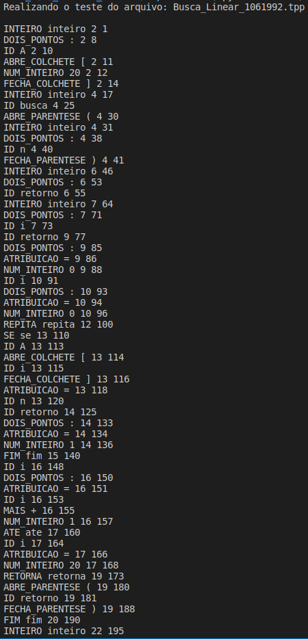

# Relatório Léxica

# Especificação da linguagem T++

A linguagem desenvolvida para a concepção do compilador é a T++, semelhante à C++, no qual é completamente em português e descrita pelo professor como no exemplo a seguir:

```cpp
inteiro: n
inteiro: b

inteiro fat( flutuante: a, inteiro: b)
    a:= 10.5
fim

inteiro fatorial(inteiro: n)
    inteiro: fat
    se n > 0 entao {nao calcula se n > 0}
        fat := 1
        repita
            fat := fat * n
            n := n - 1
        ate n = 0
        retorna(fat) {retorna o valor do fatorial de n}
    senao
        retorna(0)
    fim
fim

inteiro principal()
    leia(n)
    escreva(fatorial(n))
    escreva(fat(1,1))
fim
```

# Especificação do Analisador Léxico

O analisador léxico foi implementado em Python3, utilizando a biblioteca ply, no qual implementa o lex (analisador léxico) e o yacc (analisador gramatical).

Inicialmente foi estabelecido uma lista de tokens a serem adicionados, porém houve-se a necessidade de implementar outros. Os tokens reconhecidos são:

```cpp
tokens = (
    'MAIS',
    'MENOS',
    'MULTIPLICACAO',
    'DIVISAO',
    'DOIS_PONTOS',
    'VIRGULA',
    'MENOR',
    'MAIOR',
    'IGUAL',
    'DIFERENTE', 
    'MENOR_IGUAL', 
    'MAIOR_IGUAL', 
    'E_LOGICO',
    'OU_LOGICO',
    'NEGACAO',
    'ABRE_PARENTESE',
    'FECHA_PARENTESE',
    'ABRE_COLCHETE',
    'FECHA_COLCHETE',
    'ABRE_CHAVE',
    'FECHA_CHAVE',
    'SE', 
    'ENTAO', 
    'SENAO', 
    'FIM', 
    'REPITA', 
    'ATE', 
    'ATRIBUICAO', 
    'LEIA', 
    'ESCREVA', 
    'RETORNA', 
    'INTEIRO', 
    'FLUTUANTE', 
    'NUM_INTEIRO', 
    'NUM_PONTO_FLUTUANTE', 
    'NUM_NOTACAO_CIENTIFICA', 
    'ID',
    'FUNCAO',
)
```

Para denifir as regras, utiliza-se o padrão de implementação descrito pela documentação do PLY.  Sendo assim as regras básicas são definidas por uma expressão regular (RE) do Python, já as regras que necessitam de uma ação são realizam tais funções:

```cpp
##REGRAS COM ACAO

#Define um ID como uma sequencia de qualquer caractere alfabético, 
#seguido de qualquer quantidade sequências de caracteres
def t_ID(t):
    r'[a-zA-Z_][a-zA-Z_0-9]*'
    t.type = reservadas.get(t.value, 'ID')
    return t

#Define um valor de ponto flutuante
def t_NUM_PONTO_FLUTUANTE(t):
    r'\d+\.\d*'
    t.value = float(t.value)
    return t

#Define um valor inteiro
def t_NUM_INTEIRO(t):
    r'\d+'
    t.value = int(t.value)
    return t

#Descreve uma nova linha
def t_newline(t):
    r'\n+'
    t.lexer.lineno += len(t.value)

# Ignorando espaços em brancos, podendo ser espaços ou tabulações
t_ignore  = ' \t'

# Lidando com erros
def t_error(t):
    print("Caractere nao aceito '%s'" % t.value[0])
    t.lexer.skip(1)
```

Assim para a execução de todos os testes, foi implementado um laço de repetição, no qual verifica todos os testes. Cada teste é executado após o usuário apertar enter.

```cpp
##ROTINA AUXILIAR
# Contruindo o lexer
lexer = lex.lex()
# Realizando a leitura do arquivo`
for data_name in sorted(os.listdir("./Lexica/lexica-testes/")):
    print ("Realizando o teste do arquivo: " + str(data_name) + '\n')
    data = open("./Lexica/lexica-testes/" + str(data_name), 'r')

# Entrando com arquivo no lexer
    lexer.input(data.read())

# Tokenize
    while True:
        tok = lexer.token()
        if not tok: 
            break      # Quando não tiver mais token para realizar a analise
        print(tok.type, tok.value, tok.lineno, tok.lexpos)
    
    while True:
        print("\nAperte enter para realizar o próximo teste...")
        response = (str(input()))
        print ((response))
        if response == "":
            break
```

 Como resultado, pode-se observar a identificação dos tokens e atribuição deles. Os testes executados são identificados na primeira linha impressa no terminal.




